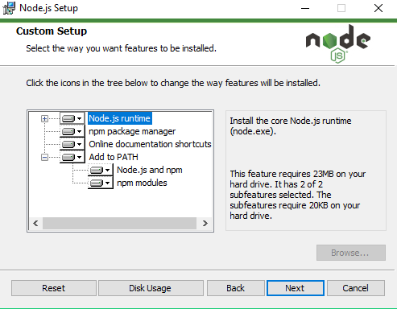
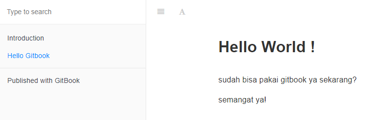

# GitBook
Anda dapat memahami lebih lanjut tentang gitbook dan dokumentasi resmi pada halaman berikut https://docs.gitbook.com/

## Introduction to GitBook
Gitbook adalah platofrm modern untuk melakukan dokumentasi software. Pada tutorial ini, akan saya tunjukan cara mengsintall gitbook
pada windows.

#### 1. Melakukan Instalasi Node JS
Kunjungi website https://nodejs.org/en/download/ dan unduh file instalasi dengan extension (.msi) sesuai dengan tipe pada sistem anda(x32/x64).

Setelah file instalasi terunduh, silahkan buka file instalasi nodejs pada komputer anda. Lakukan instalasi seperti biasa, pada proses instalasi ini, perhatikan PATH yang akan terinstall, pastikan PATH untuk npm terinstall pada komputer anda. Seperti berikut :



Pastikan anda melakukan instalasi NodeJs sampai selesai.

#### 2. Melakukan Instalasi GitBook
Pastikan anda sudah menginstall NodeJs dan NPM. Pada tutorial ini kita akan membutuhkan koneksi internet yang stabil untuk melakukan insalasi.
1. 

1. Buka Node.js command prompts :

1. 

1. Ketik kode ini `npm install gitbook-cli -g` pada Node.js command prompt untuk melakukan installasi gitbook. Tunggu sampai instalasi berakhir seperti berikut :

1. 


#### 3. Menggunakan gitbook
1. Untuk membuat book baru, setelah instalasi gitbook kamu bisa ketik kode `gitbook init ./Coba`. Tunggu sampai selesai seperti gambar berikut

1. 

1. Silahkan buka text editor(vscode/sublime).

1. Karena pada langkah pertama kita melakukan init pada folder `Coba`, maka lakukan open folder pada text editor kamu yang terletak di ``C:/Users/<nama user>/Coba``. Setelah kamu membuka folder, pada text editor kamu menjadi seperti ini :

1. 

1. Buat file baru dengan nama `Pertama.md` isi file tersebut dengan :

```
# Hello World!

sudah bisa pakai gitbook ya sekarang?

semangat ya!

```
7. Pada folder tersebut terdapat file ```SUMMARY.md``` kamu harus mengisikan nama file sehingga file yang udah di buat dapat bisa dibuka gitbook.

```
# Summary

* [Introduction](README.md)
* [Hello GitBook](Pertama.md)

```

#### 4. Menjalankan GitBook
1. Buka Node.js Command Prompt, lalu ketik `gitbook serve ./Coba` dan tunggu beberapa saat sampai selesai seperti gambar berikut :

1. 

1. Pada command prompt tersebut akan ada lokasi server local yang dapat kamu akses. Pada gambar tersebut dapat kita akses pada link ```localhost:4000```

1. Setelah kamu mengakses link tersebut, berikut hasil akhir nya :

1. 


## Summary

Thanks.
